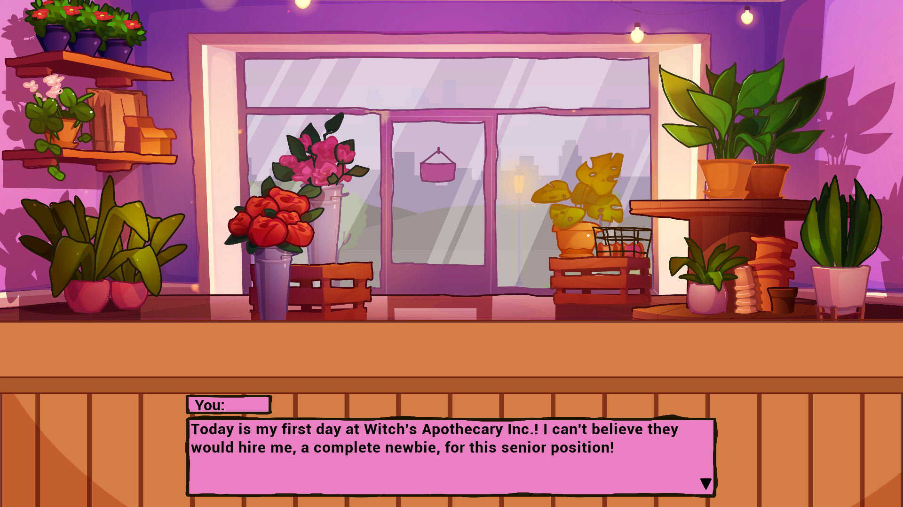
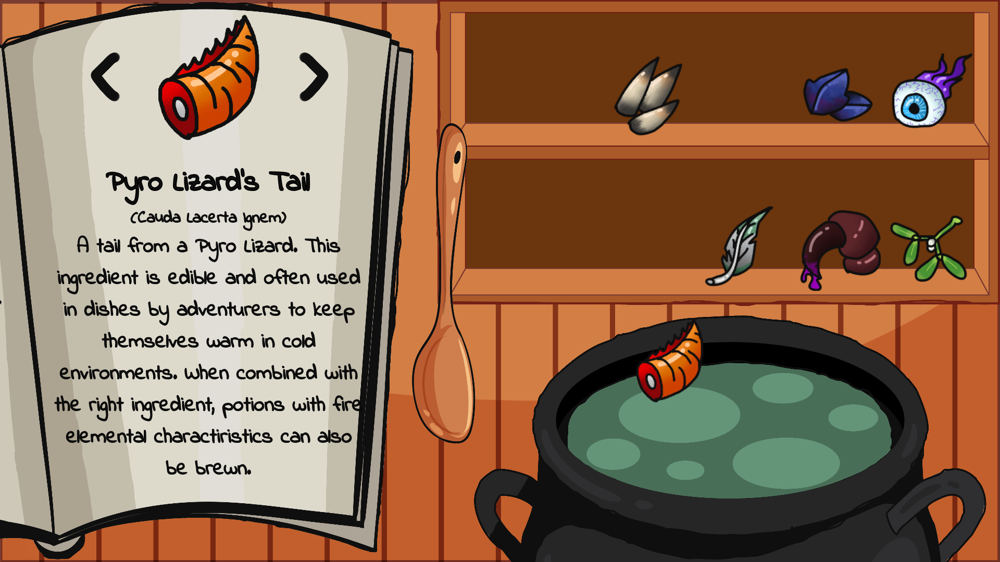
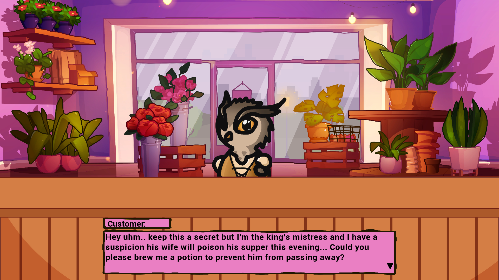

# Witch's Apothecary

You're just getting started as a newbie employee at the well known Witch's Apothecary. Although you have no experience in potion making, you shoot your shot for a well paying senior position and... get accepted??? Can you keep up this establishments reputation, or will you tarnish it?

Take requests from customers and brew potions in this cozy game with a mix of visual novel and point-and-click!

## Game Jam
This game was a submission for the [Inbound Shovel Jam 2025][15] game jam.
 
The game has been released on [Itch.io][16] to be downloaded & played.

## About
We're two game devs who have been making games for a while, but never entered a game jam on our own let alone together! We in total spent about 4 days on it and made the entire thing in... Unreal Engine 5 UMG (which somehow worked out lol). We're both programmers, so a big part of assets have been flipped or just taken off the interwebs (all credits down below!)

## Note
This game was made with an aspect ratio of 16:9 and resolution of 1080p in mind. No testing has been done for other resolutions & aspect ratio's. So the game might look off in those instances.

The game is also always launched in fullscreen, and has no settings to adjust.

# Credits
Programming, Writing - [Stefan Claasse][0] 
 
Programming, Art, Writing - [Lon van Ettinger][1]

### Art assets
Base for the following art assets: Shop Counter, Shop Interior, Shelves and Wall, Cauldron, Book, Ladle, Newspaper, Stars - [Designed by Freepik][2] (no AI-generated images used)

### Audio assets
Main menu music - [Piano and effects track loop][3] by frankum

In-game music - [Jazz Background Music Loop][4] by Migfus20

Cauldron bubbling ambience - [bubbles fast.wav][5] by 13henand

Night crickets ambience - [Night Crickets 02][6] by Vrymaa

Door chime SFX - [SMALL BELL - 1][7] by SamuelGremaud

Cauldron drop SFX - [Potion Splash][8], [Drip Sound][9], [Fine Water Drop][10], [Bottle Splash][11] by qubodup

Completion chime SFX - [Complete Chime][12] by FoolBoyMedia

Cauldron stirring SFX - [Water bottle shake][13] by blouhond

Page flip SFX - [flip page][14] by ROFD

[0]: https://stefanclaasse.com/
[1]: https://lonvanettinger.com/
[2]: https://www.freepik.com/
[3]: https://freesound.org/s/317366/
[4]: https://freesound.org/s/559850/
[5]: https://freesound.org/s/217206/
[6]: https://freesound.org/s/805466/
[7]: https://freesound.org/s/517611/
[8]: https://freesound.org/s/792929/
[9]: https://freesound.org/s/792926/
[10]: https://freesound.org/s/792927/
[11]: https://freesound.org/s/792925/
[12]: https://freesound.org/s/352661/
[13]: https://freesound.org/s/402988/
[14]: https://freesound.org/s/188485/
[15]: https://itch.io/jam/shovel-jam-2025
[16]: https://xyaoqii.itch.io/witchs-apothecary